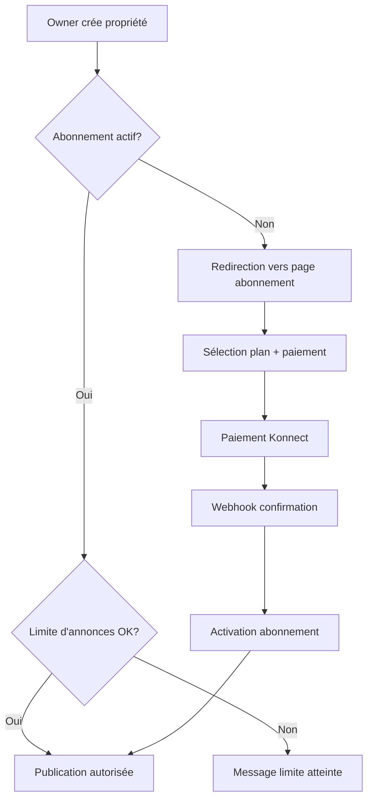

# PRD - Système d'Abonnements avec Konnect
## Product Requirements Document

**Version:** 1.0  
**Date:** Janvier 2025  
**Statut:** En développement  
**Responsable:** Équipe de développement  

---

## 📋 **1. VUE D'ENSEMBLE**

### 1.1 Objectif
Implémenter un système d'abonnements pour les propriétaires avec 3 niveaux d'accès, utilisant Konnect comme solution de paiement.

### 1.2 Problème à résoudre
- Les propriétaires n'ont actuellement aucune limitation sur le nombre d'annonces
- Aucun système de monétisation pour la plateforme
- Pas de contrôle sur la qualité et la durée des publications

### 1.3 Solution proposée
Système d'abonnements avec 3 plans :
- **Basic** : 1 annonce pendant 1 an
- **Standard** : 3 annonces pendant 1 an  
- **Professional** : Annonces illimitées pendant 1 an

---

## 🎯 **2. OBJECTIFS ET MÉTRIQUES**

### 2.1 Objectifs business
- [ ] Générer des revenus récurrents
- [ ] Contrôler la qualité des annonces
- [ ] Améliorer l'engagement des propriétaires
- [ ] Réduire le spam d'annonces

### 2.2 Métriques de succès
- **Taux de conversion** : >15% des propriétaires s'abonnent
- **Rétention** : >80% de renouvellement après 1 an
- **Revenus** : Objectif de 1000€/mois en 6 mois
- **Satisfaction** : >4.5/5 sur l'expérience d'abonnement

---

## 👥 **3. PERSONAS ET CAS D'USAGE**

### 3.1 Persona Principal : Propriétaire
- **Besoins** : Publier des annonces de qualité, contrôler la visibilité
- **Frustrations** : Limites d'annonces, coûts élevés
- **Objectifs** : Maximiser les réservations, gérer efficacement

### 3.2 Cas d'usage principaux
1. **Sélection d'abonnement** : Propriétaire choisit un plan
2. **Paiement** : Processus de paiement via Konnect
3. **Publication d'annonce** : Vérification des limites d'abonnement
4. **Gestion d'abonnement** : Renouvellement, upgrade, annulation

---

## 🏗️ **4. ARCHITECTURE TECHNIQUE**

### 4.1 Stack technologique
- **Frontend** : React + TypeScript + TailwindCSS + shadcn/ui
- **Backend** : Supabase (PostgreSQL + Edge Functions)
- **Paiements** : Konnect API
- **Authentification** : Supabase Auth

### 4.2 Diagramme d'architecture
```
[Frontend React] 
    ↓
[Supabase Edge Functions]
    ↓
[Konnect API] ← → [Base de données PostgreSQL]
```

---

## 🗄️ **5. MODÈLE DE DONNÉES**

### 5.1 Nouvelles tables

#### Table `subscription_plans`
```sql
CREATE TABLE subscription_plans (
  id UUID PRIMARY KEY DEFAULT gen_random_uuid(),
  name TEXT NOT NULL, -- "Basic", "Standard", "Professional"
  max_properties INTEGER, -- 1, 3, NULL (illimité)
  duration_months INTEGER NOT NULL DEFAULT 12,
  price DECIMAL(10,2) NOT NULL,
  features JSONB, -- fonctionnalités incluses
  is_active BOOLEAN DEFAULT true,
  created_at TIMESTAMP WITH TIME ZONE DEFAULT now(),
  updated_at TIMESTAMP WITH TIME ZONE DEFAULT now()
);
```

#### Table `owner_subscriptions`
```sql
CREATE TABLE owner_subscriptions (
  id UUID PRIMARY KEY DEFAULT gen_random_uuid(),
  owner_id UUID NOT NULL REFERENCES profiles(id) ON DELETE CASCADE,
  plan_id UUID NOT NULL REFERENCES subscription_plans(id),
  status TEXT NOT NULL CHECK (status IN ('active', 'expired', 'cancelled', 'pending')),
  start_date TIMESTAMP WITH TIME ZONE NOT NULL,
  end_date TIMESTAMP WITH TIME ZONE NOT NULL,
  payment_status TEXT NOT NULL CHECK (payment_status IN ('pending', 'paid', 'failed', 'refunded')),
  konnect_payment_id TEXT, -- ID du paiement Konnect
  auto_renew BOOLEAN DEFAULT false,
  created_at TIMESTAMP WITH TIME ZONE DEFAULT now(),
  updated_at TIMESTAMP WITH TIME ZONE DEFAULT now()
);
```

#### Table `property_publications`
```sql
CREATE TABLE property_publications (
  id UUID PRIMARY KEY DEFAULT gen_random_uuid(),
  property_id UUID NOT NULL REFERENCES properties(id) ON DELETE CASCADE,
  subscription_id UUID NOT NULL REFERENCES owner_subscriptions(id),
  published_at TIMESTAMP WITH TIME ZONE NOT NULL,
  expires_at TIMESTAMP WITH TIME ZONE NOT NULL,
  status TEXT NOT NULL CHECK (status IN ('active', 'expired', 'paused')),
  created_at TIMESTAMP WITH TIME ZONE DEFAULT now(),
  updated_at TIMESTAMP WITH TIME ZONE DEFAULT now()
);
```

### 5.2 Modifications des tables existantes

#### Table `properties` - Ajouter
```sql
ALTER TABLE properties ADD COLUMN requires_subscription BOOLEAN DEFAULT true;
ALTER TABLE properties ADD COLUMN publication_status TEXT DEFAULT 'draft' 
  CHECK (publication_status IN ('draft', 'pending_payment', 'published', 'expired'));
```

---

## 💳 **6. INTÉGRATION KONNECT**

### 6.1 Configuration Konnect
- **Environnement** : Sandbox (dev) + Production
- **API Endpoints** : 
  - Initiation de paiement
  - Vérification de statut
  - Webhooks de confirmation

### 6.2 Edge Functions Supabase

#### `create-subscription-payment`
```typescript
// Fonction pour initier un paiement d'abonnement
export async function createSubscriptionPayment(planId: string, ownerId: string) {
  // 1. Vérifier le plan d'abonnement
  // 2. Créer l'abonnement en statut "pending"
  // 3. Initier le paiement Konnect
  // 4. Retourner l'URL de paiement
}
```

#### `konnect-webhook-handler`
```typescript
// Fonction pour gérer les webhooks Konnect
export async function handleKonnectWebhook(paymentData: any) {
  // 1. Vérifier la signature du webhook
  // 2. Mettre à jour le statut de paiement
  // 3. Activer l'abonnement si paiement réussi
  // 4. Envoyer notification au propriétaire
}
```

---

## 🎨 **7. INTERFACE UTILISATEUR**

### 7.1 Pages à créer

#### Page de sélection d'abonnement (`/subscription/plans`)
- **Composants** :
  - `SubscriptionPlanCard` : Carte de plan avec comparaison
  - `PlanComparison` : Tableau comparatif des plans
  - `PaymentButton` : Bouton d'initiation de paiement

#### Page de gestion d'abonnement (`/dashboard/subscription`)
- **Composants** :
  - `SubscriptionStatus` : Statut actuel de l'abonnement
  - `UsageIndicator` : Indicateur d'utilisation des annonces
  - `RenewalSettings` : Paramètres de renouvellement
  - `PaymentHistory` : Historique des paiements

### 7.2 Modifications des pages existantes

#### Dashboard Owner
- Ajouter widget d'abonnement dans la sidebar
- Indicateur de limite d'annonces
- Bouton "Gérer mon abonnement"

#### Wizard d'ajout de propriété
- Vérification d'abonnement avant publication
- Redirection vers page d'abonnement si nécessaire
- Limitation du nombre d'annonces selon le plan

---

## 🔧 **8. LOGIQUE MÉTIER**

### 8.1 Hooks React

#### `useSubscription`
```typescript
export const useSubscription = () => {
  const [subscription, setSubscription] = useState<Subscription | null>(null);
  const [loading, setLoading] = useState(true);
  
  const checkSubscriptionStatus = async () => { /* ... */ };
  const canPublishProperty = (): boolean => { /* ... */ };
  const getRemainingProperties = (): number => { /* ... */ };
  
  return {
    subscription,
    loading,
    checkSubscriptionStatus,
    canPublishProperty,
    getRemainingProperties
  };
};
```

#### `useSubscriptionLimits`
```typescript
export const useSubscriptionLimits = () => {
  const checkPropertyLimit = async (ownerId: string): Promise<boolean> => { /* ... */ };
  const getAvailableSlots = async (ownerId: string): Promise<number> => { /* ... */ };
  
  return { checkPropertyLimit, getAvailableSlots };
};
```

### 8.2 Services

#### `SubscriptionService`
```typescript
export class SubscriptionService {
  static async createSubscription(planId: string, ownerId: string): Promise<Subscription> { /* ... */ };
  static async getOwnerSubscription(ownerId: string): Promise<Subscription | null> { /* ... */ };
  static async updateSubscriptionStatus(subscriptionId: string, status: string): Promise<void> { /* ... */ };
  static async checkPropertyLimit(ownerId: string): Promise<boolean> { /* ... */ };
}
```

#### `PaymentService`
```typescript
export class PaymentService {
  static async initiatePayment(amount: number, planId: string): Promise<PaymentResponse> { /* ... */ };
  static async verifyPayment(paymentId: string): Promise<boolean> { /* ... */ };
  static async handleWebhook(paymentData: any): Promise<void> { /* ... */ };
}
```

---

## 📊 **9. WORKFLOW DE PUBLICATION**

### 9.1 Flux de publication d'annonce


### 9.2 Vérifications d'abonnement
- **Avant publication** : Vérifier abonnement actif + limite
- **Pendant création** : Afficher statut d'abonnement
- **Après paiement** : Activer immédiatement l'abonnement

---

## 🔔 **10. NOTIFICATIONS**

### 10.1 Types de notifications
- **Email** : Confirmations de paiement, rappels d'expiration
- **In-app** : Alertes de limite atteinte, statut d'abonnement
- **Push** : Rappels de renouvellement (futur)

### 10.2 Templates d'emails
- Confirmation d'abonnement
- Rappel d'expiration (30, 7, 1 jour avant)
- Notification de limite d'annonces
- Confirmation de paiement

---

## 🧪 **11. TESTS**

### 11.1 Tests unitaires
- [ ] `SubscriptionService` - CRUD des abonnements
- [ ] `PaymentService` - Intégration Konnect
- [ ] `useSubscription` - Hooks React
- [ ] Validation des limites d'abonnement

### 11.2 Tests d'intégration
- [ ] Workflow complet de sélection → paiement → activation
- [ ] Webhooks Konnect
- [ ] Vérification des limites de publication
- [ ] Gestion des erreurs de paiement

### 11.3 Tests E2E
- [ ] Parcours complet d'abonnement
- [ ] Publication d'annonce avec abonnement
- [ ] Gestion d'abonnement (renouvellement, annulation)

---

## 📈 **12. MONITORING ET ANALYTICS**

### 12.1 Métriques à suivre
- **Conversion** : Taux d'abonnement par plan
- **Rétention** : Taux de renouvellement
- **Revenus** : MRR (Monthly Recurring Revenue)
- **Usage** : Nombre d'annonces publiées par plan

### 12.2 Dashboards
- **Admin** : Vue d'ensemble des abonnements et revenus
- **Owner** : Statut d'abonnement et utilisation
- **Analytics** : Métriques de performance

---

## 🚀 **13. ROADMAP D'IMPLÉMENTATION**

### Phase 1 : Fondations (Semaine 1-2)
- [ ] **Sprint 1.1** : Création des tables et migrations
  - [ ] Table `subscription_plans`
  - [ ] Table `owner_subscriptions`
  - [ ] Table `property_publications`
  - [ ] Modification table `properties`
  - [ ] RLS policies

- [ ] **Sprint 1.2** : Services backend
  - [ ] `SubscriptionService`
  - [ ] `PaymentService`
  - [ ] Edge Functions de base

### Phase 2 : Intégration Konnect (Semaine 3-4)
- [ ] **Sprint 2.1** : Configuration Konnect
  - [ ] Configuration sandbox/production
  - [ ] Edge Function `create-subscription-payment`
  - [ ] Edge Function `konnect-webhook-handler`

- [ ] **Sprint 2.2** : Tests d'intégration
  - [ ] Tests de paiement Konnect
  - [ ] Tests de webhooks
  - [ ] Validation des flux de paiement

### Phase 3 : Interface utilisateur (Semaine 5-6)
- [ ] **Sprint 3.1** : Pages d'abonnement
  - [ ] Page de sélection d'abonnement
  - [ ] Page de gestion d'abonnement
  - [ ] Composants UI réutilisables

- [ ] **Sprint 3.2** : Intégration dashboard
  - [ ] Widget d'abonnement dans sidebar
  - [ ] Modification du wizard de propriété
  - [ ] Hooks React (`useSubscription`, `useSubscriptionLimits`)

### Phase 4 : Logique métier (Semaine 7-8)
- [ ] **Sprint 4.1** : Workflow de publication
  - [ ] Vérifications d'abonnement
  - [ ] Gestion des limites
  - [ ] Redirections et messages d'erreur

- [ ] **Sprint 4.2** : Notifications
  - [ ] Templates d'emails
  - [ ] Notifications in-app
  - [ ] Système de rappels

### Phase 5 : Tests et optimisation (Semaine 9-10)
- [ ] **Sprint 5.1** : Tests complets
  - [ ] Tests unitaires
  - [ ] Tests d'intégration
  - [ ] Tests E2E

- [ ] **Sprint 5.2** : Optimisation et monitoring
  - [ ] Dashboards analytics
  - [ ] Monitoring des erreurs
  - [ ] Optimisation des performances

### Phase 6 : Déploiement et post-lancement (Semaine 11-12)
- [ ] **Sprint 6.1** : Déploiement
  - [ ] Déploiement en production
  - [ ] Configuration Konnect production
  - [ ] Tests de validation

- [ ] **Sprint 6.2** : Post-lancement
  - [ ] Monitoring des métriques
  - [ ] Support utilisateurs
  - [ ] Itérations basées sur les retours

---

## 🎯 **14. CRITÈRES D'ACCEPTATION**

### 14.1 Fonctionnalités obligatoires
- [ ] Propriétaires peuvent sélectionner un plan d'abonnement
- [ ] Paiement sécurisé via Konnect
- [ ] Vérification automatique des limites d'annonces
- [ ] Gestion complète des abonnements (renouvellement, annulation)
- [ ] Notifications appropriées

### 14.2 Performance
- [ ] Temps de réponse < 2s pour les vérifications d'abonnement
- [ ] Disponibilité > 99.9% du système de paiement
- [ ] Gestion des erreurs robuste

### 14.3 Sécurité
- [ ] Validation côté serveur de tous les paiements
- [ ] Chiffrement des données sensibles
- [ ] Audit trail complet des transactions

---

## 📝 **15. NOTES ET CONSIDÉRATIONS**

### 15.1 Risques identifiés
- **Intégration Konnect** : Complexité de l'API, gestion des webhooks
- **Migration des données** : Propriétaires existants sans abonnement
- **UX** : Équilibre entre sécurité et facilité d'utilisation

### 15.2 Mitigations
- Tests approfondis de l'intégration Konnect
- Période de transition avec abonnements gratuits
- Design UX itératif basé sur les retours utilisateurs

### 15.3 Évolutions futures
- Plans d'abonnement personnalisés
- Système de parrainage
- Analytics avancés pour les propriétaires
- Intégration avec d'autres méthodes de paiement

---

## 📞 **16. CONTACTS ET RESSOURCES**

### 16.1 Équipe
- **Product Owner** : [Nom]
- **Tech Lead** : [Nom]
- **Frontend** : [Nom]
- **Backend** : [Nom]

### 16.2 Ressources
- **Documentation Konnect** : [Lien]
- **Design System** : shadcn/ui
- **Base de données** : Supabase PostgreSQL
- **Déploiement** : Supabase Edge Functions

---

**Dernière mise à jour** : [Date]  
**Prochaine révision** : [Date + 2 semaines]
